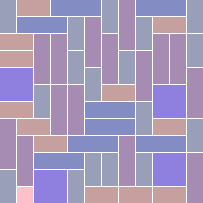

<!-- SPDX-License-Identifier: Artistic-2.0 -->

#  Regulatum

<div>
  </img>
</div>


##  NAME

Regulatum : Generate random rectangular tiling patterns as SVG output


##  SYNOPSIS

```
regulatum [OPTION...]
```


###  Local execution

For now this may be run as a local module.  Install Rakudo and add the Raku
executable to your path.  Then call the regulatum.raku CLI driver, adding the
module's directory to the module search path with `-I`:

```
raku -I /path/to/regulatum/dir/ /path/to/regulatum/dir/bin/regulatum.raku [OPTION...]
```

In the event that this joins the Raku module ecosystem, more appropriate
guidance will be provided.


##  DESCRIPTION

Regulatum programmatically generates rectangular tiling patterns on a grid
background.  Output is a specification of individual tile shapes in SVG format.

Users define the dimensionality of the domain, the tiles which may occupy that
space, and possibly other parameters.  Individual tiles are randomly selected
for placement; rules governing alternative selections may be specified to handle
cases in which the proposed tile cannot fit in the available space.  Regulatum
is not designed to produce output representing any class of repeating pattern or
tessellation.

SVG rendering is of course limited to two dimensions.  Regulatum is capable of
producing consistent n-dimensional output, however, and theoretically could
print such output for an accommodating renderer.

A command-line interface is available and is described here.  Another Raku
program could also employ the internal classes and functionality in a fashion
similar to the CLI.  (Explicit documentation for such usage is not yet
available.)


##  OPTIONS

The alphabetic keys in the listing below indicate the type of data expected as
arguments:

<pre>
  J: String containing valid JSON
  N: Zero or a positive integer
  P: Path and filename
  S: String
</pre>


###  Options used to define parameters relevant to the tiling process

<pre>
  -d                      J  The dimensions of the space.
  --dimensions                 This takes the form of a JSON array of integers.
                             Each element is the size of (that is: the number of
                             units within) the corresponding dimension.
                               The ordering begins with the x axis and
                             dimensionality increases from left to right; that
                             is: x, y, z, ... .
                             Default: (none)

  -t                      J  The available tiles.
  --tiles                      This should be a JSON array of one or more
                             arrays, each representing a tile.  Tiles are
                             defined by a series of integers indicating
                             dimensional extension, a color, and a probability
                             of being selected.
                               See the Tiles section below for details.
                             Default: (none)

  -f                      J  The agenda employed (the "fit strategy") to obtain
  --fit-strategy             a tile fit in an inning.
                               The form is that of a JSON array of one or more
                             positive integers, each of which represents an
                             independent tactic; the tactics are progressively
                             employed to find a fit.  The strategy begins with
                             the first element of the array and ends with the
                             last.
                               The available tactics are presented in the Fit
                             Tactics section below.
                             Default: (none)

  -s                      N  The spacing ratio.
  --spacing-ratio              The proportion of intertile space to the tile
  --spacing                  width and height.  This value is n in the ratio n:1
                             (or 1/n).
                             Default: 16

  -c                      S  The default tile color.
  --tile-color-default         The color to be used for tiles in the absence of
  --tile-colour-default      tile-specific color definitions or rules.
                               Application of this value depends on the coloring
                             method and the default color selection setting.
                             Default: "#000"

  -C                      J  A set of available colors used by selected coloring
  --colors                   methods.
  --colours                    This takes the form of a JSON array of one or more
                             strings representing colors.
                               See also the Colors section below.
                             Default: (none)

  -m                      S  The method used in coloring defined tiles.
  --coloring-method            Options are presented in the Coloring Methods
  --coloring                 section below.
  --colouring-method         Default: "tiles"
  --colouring

  -M                      S  The method of selecting a default tile color.
  --default-color-selection    Options are presented in the Default Color
  --default-colour-selection Selection section below.
                             Default: "default"

  -o                      P  The target file for output.  Will overwrite any
  --output-file              existing file.
                               The base directory is user home.
                               All output is directed to standard output by
                             default and can therefore be redirected as desired
                             without use of this switch.
                             Default: (writes to standard output)

  -V                      P  The target file for any verbosity content.  Will
  --verbosity-out            overwrite any existing file.
                               The base directory is user home.
                               See also the Verbosity section below.
                             Default: (writes to standard output)
</pre>

### Other options

<pre>
  -x                         Ignore any default configuration file if one
  --ignore-default-config    exists.

  -i                      P  The location of a file containing configuration to
  --config                   inform processing.
  --config-file                The base directory is user home.
                               See also Configuration Sources below.

  -v                      N  The verbosity setting.
  --verbosity                  See the Verbosity section below for options.
                             Default: 0
</pre>

###  Terminable Options

These options produce the requested output and immediately quit.

<pre>
  --print-config             Print the contents of any default configuration
                             file.

  --version                  Print the version number of this program.

  -h                         Print short help text.
  --help

  --man                      Print extended man-style help text.  (The current
                             text.)
</pre>

(Hyphens in the names of the long switches may be replaced by underscores if
desired; for example: the long switch `--spacing_ratio` is equivalent to
`--spacing-ratio`.)


##  Requirements

Processing at a minimum requires the user to define dimensions and tiles.

Other parameters possess defaults, are contingent upon others, or are entirely
optional.


##  Configuration Sources

This interface will attempt to aggregate options for parameters from three
sources (listed here in decreasing order of priority):

  - Command line options

  - User-defined configuration file (identified via the `config-file` option)

  - Default configuration file

The process will run as long as a sufficient parameter set can be collected from
one or more of the above sources.


Configuration files must be in valid JSON format.  For the moment (greater
flexibility could later be introduced) the keys must be the underscore versions
of the long switches; namely:

>`dimensions`, `tiles`, `fit_strategy`, `spacing_ratio`, `tile_color_default`, `colors`,
 `coloring_method`, `default_color_selection`, `output_file`, `verbosity`,
 `verbosity_out`


##  Tile Definition

The basic form is a JSON array of arrays, where the inner arrays represent
tiles:

```
[ [x, y, z, ..., "color", p], [x, y, z, ..., "color", p], ... ]
```

The initial values are positive integers indicating the length (or extension) of
the tile in the respective dimension.  Next is a string indicating the color
(see the Colors section).  The final element is a positive integer between 1 and
100 (inclusive) which determines the probability that the tile will be chosen
during each inning of laying tiles.

For example, the array `[2, 4, "purple", 60]` defines a tile which extends 2 units
along the x axis and 4 units along the y axis, will be colored purple (assuming
that the coloring method allows it), and has a 60% chance of being selected to
attempt to fill an empty space.  (Of course circumstances of available space may
nevertheless prevent placement.)


Notes on extension specification:

  - The number of extension values must agree with the dimensionality as defined
    in the dimensions parameter.

  - Tiles without positive integers specified for all extensions will be
    ignored.


Notes on color specification:

  - If the color is an empty string then `tile_color_default` will be used for
    that tile.  (Such a specification is interpreted to mean that a color should
    still be set by some means but that the user is declining to specify one.)

  - The use of individual tile colors supplied ultimately depends upon the
    settings of `coloring_method` and `default_color_selection`.


Notes on probability specification:

  - Tiles with a probability value less than 1 will be ignored.

  - The probability values of all valid tiles may sum to less than 100.  Any
    remainder prescribes an empty space of size 1 in all dimensions.

  - If the total probability value is greater than 100 then steps will be taken
    to reduce it to said maximum.  Namely, the probability value of the
    last-specified tile may be truncated and/or entire tiles may be ignored.


##  Colors

All user-specified colors should be in a standard representation supported by
SVG documents.

Colors randomly generated by Regulatum (via the "random-each" or
"random-each-truncated" methods of certain options) are rendered in either
three- or six-digit hexadecimal notation.


##  Fit Tactics

### Minimal satisfaction

  1: Place a tile which is one unit in length in all dimensions (irrespective of
     whether or not such a tile has been prescribed).  Will always be
     successful.

###  Best existing match

  2: Select the best-fitting tile from the tileset if one exists.  Currently
     this means choosing the tile with the smallest overall distance from the
     boundaries of available space.  If multiple tiles happens to have the same
     differential ranking then one of them is chosen at random.

###  Transformation (reduction)

  Reduce the length of one or more dimensions of the proposed tile.  The
  reduction should be minimal; that is: both the reduction in length and the
  number of dimensions affected should be only that required to ensure a fit.

  3: (Restricted by available tiles.)  Will succeed only if a tile with the
     necessary dimensions has been defined.

  4: (Not restricted by available tiles.)  If a tile with the necessary
     dimensions has been defined then it will be used; otherwise generate an
     ad-hoc tile.  Per the above specification, said tile should possess
     extensions as close to the original proposed tile as possible.

###  Rotation (reorientation)

  Determine if a different orientation of the proposed tile will satisfy the
  placement conditions.

  5: (Restricted by available tiles.)  Will succeed only if a tile with the
     necessary assignments of lengths to dimensions has been defined.

  6: (Not restricted by available tiles.)  If a tile with the necessary
     assignments of lengths to dimensions has been defined then it will be used;
     otherwise generate a tile ad-hoc to the necessary specifications.  If more
     than one tile satisfies the requirements (something only possible in spaces
     with more than two dimensions) then the first matching tile will be used.


##  Coloring Methods

The set of available coloring methods.

<dl>
  <dt>tiles</dt>
  <dd>Use colors defined for each tile.</dd>

  <dt>random-colors</dt>
  <dd>Randomly select a color from the <tt>colors</tt> attribute for each tile upon
placement.  Requires that the <tt>colors</tt> attribute has been populated with at
least one color.</dd>

  <dt>random-assignment</dt>
  <dd>Randomly assign a distinct color to each tile in the set of defined tiles.
Then proceed per the "tiles" method.  Uses the smaller space of colors
represented by the three-character format of Web colors.</dd>

  <dt>random-each</dt>
  <dd>Randomly select a color (not necessarily distinct) for each tile upon
placement.  Uses the full, six-digit space of Web colors.</dd>

  <dt>random-each-truncated</dt>
  <dd>Randomly select a color (not necessarily distinct) for each tile upon
placement.  Uses the smaller space of colors represented by the three-digit
format of Web colors.</dd>
</dl>


##  Default Color Selection

The set of available options for applying a default color.

<dl>
  <dt>default</dt>
  <dd>Use the color defined in <tt>tile_color_default</tt>.</dd>

  <dt>random-tile</dt>
  <dd>Randomly select a color from the existing tiles for each tile upon
placement.  Requires the use of the "tiles" or the "random-assignment" method
for <tt>coloring_method</tt>.</dd>

  <dt>random-colors</dt>
  <dd>Randomly select a color from the <tt>colors</tt> attribute for each tile upon
placement.  Requires that the <tt>colors</tt> attribute has been populated with at
least one color.</dd>

  <dt>random-each</dt>
  <dd>Randomly select a color (not necessarily distinct across all instances of
default tiles) upon placement.  Uses the full, six-digit space of Web
colors.</dd>

  <dt>random-each-truncated</dt>
  <dd>Randomly select a color (not necessarily distinct across all instances of
default tiles) upon placement.  Uses the smaller space of colors represented
by the three-digit format of Web colors.</dd>
</dl>


##  Verbosity

Informative message content by level value (values > 0 are cumulative):

  0: None (execute silently).

  1: Warnings and alerts concerning nonfatal conditions of note.

  2: A summary of parameters before generation commences; also, the total number
     of tiles laid upon the conclusion of the process.

Note that the short as well as the long versions of this switch accept an
integer argument and do not behave in the inconsistent manner typical of many
command-line programs (that is: indicating increasing verbosity levels via
repetition of the short switch's alphabetic component).

If the target of verbosity output is identical to that of process output then
any verbose message content is commented out.


##  EXAMPLES

<div>
  </img>
</div>

This section presents some possible invocations with sample output.

Specifying four tiles, two square and two of unequal sides, to be laid on a
12-by-12 grid with unequal probability; resort (first) to shrinking proposed
tiles and (then) to one-unit pink tiles when necessary.

  ```shell
  regulatum -d '[12,12]' \
            -t '[[2,2,"#8F7FDF",8], [1,3,"#A68CB3",23], [3,1,"#838CC3",23], [1,2,"#999FB9",23], [2,1,"#C69F9F",23]]' \
            -f '[4,1]' \
            -c pink
  ```

<div>
  </img>
</div>

Produce a moderately-spaced mosaic of randomly-colored squares in a horizontal
strip.  (It doesn't matter which string we specify for the tile's color as it is
overridden by the coloring method.)

  ```shell
  regulatum -d '[14,6]' -t '[[1,1,"",100]]' -m random-each -s 5
  ```

<div>
  </img>
</div>


</div>

As above but without any intertile spacing.

  ```shell
  regulatum -d '[14,6]' -t '[[1,1,"",100]]' -m random-each -s 0
  ```

<div>
  </img>
</div>

Produce a mosaic of squares of two sizes in a vertical strip.  The colors for
each tile laid is chosen randomly from the three supplied.  The fit strategy
allows a minimal tile only.  Output is written to a file in the user's home
directory.

  ```shell
  regulatum -d '[10,20]' -t '[[1,1,"",40], [2,2,"",60]]' \
            -C '["darkslategrey", "darkslateblue", "#6F1C2A"]' \
            -m random-colors -f '[1]' -o ~/tiles.svg
  ```

<div>
  </img>
</div>

A pattern somewhat reminiscent of a complicated city plan.

  ```shell
  regulatum -d '[20,20]' \
            -t '[[2,2,"",4], [2,1,"",18], [1,2,"",18], [3,1,"",30], [1,3,"",30]]' \
            -f '[1]' -C '["#4F4F4FFF"]' -m random-colors -s 1
  ```

<div>
  </img>
</div>


##  OTHER

Proposed developments, bugs, and similar matters are tracked as
[GitHub Issues](https://github.com/D29F4/Regulatum/issues).


##  COPYRIGHT

Copyright 2022  D29F4 <!-- /at/ srvlink.com -->

Regulatum is distributed under the Artistic License, version 2.0.
